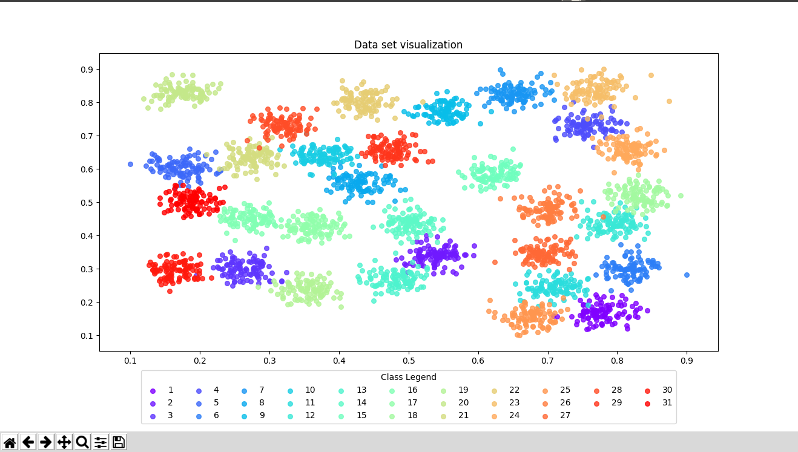
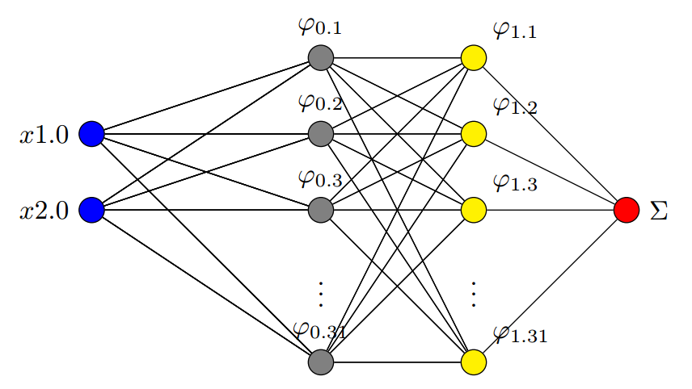
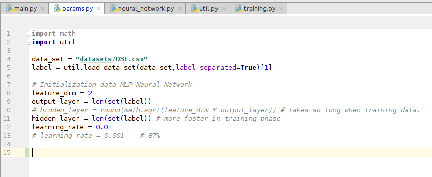
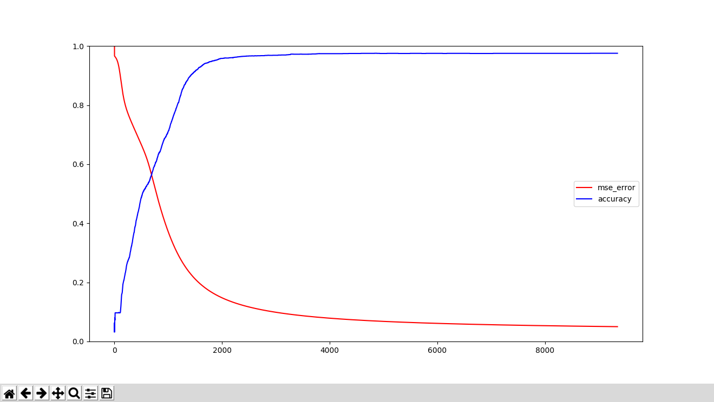
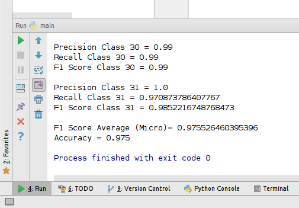
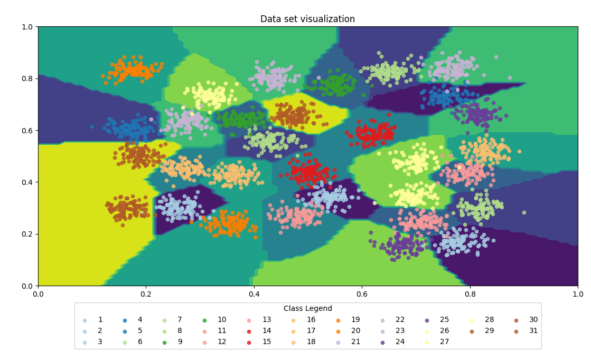
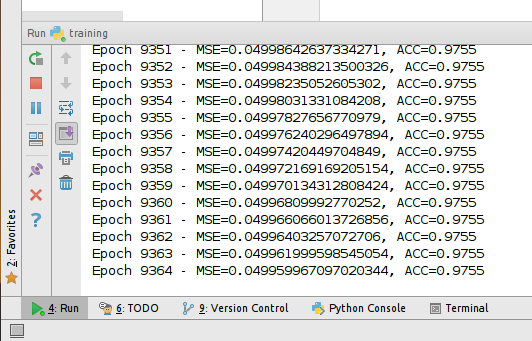

## Multi-layer Percepton Neural Network on D31 Dataset (31 Label)

### Visualization D31 Dataset

### MLP Neural Network Architecture

### ANN Parameter

### Result Classification

### Graphic Comparison

### Accuracy

### Decision Boundary

### Training Process

