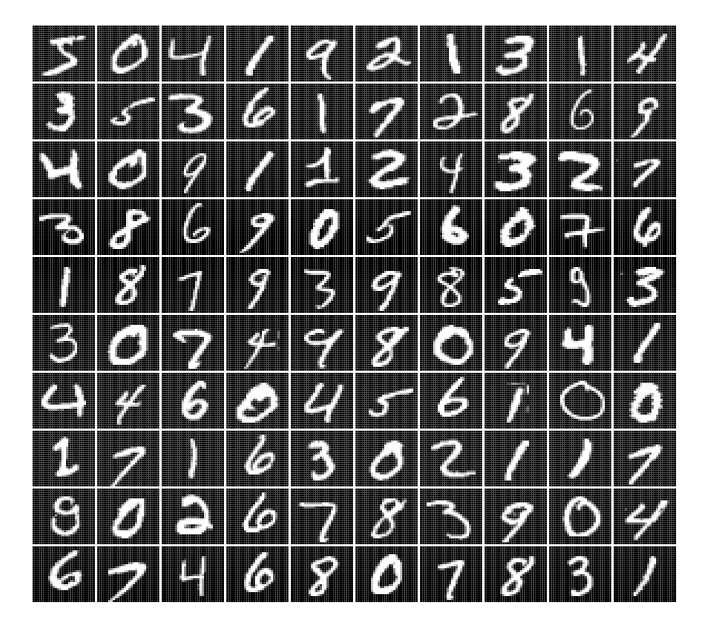
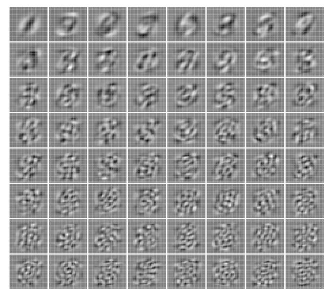
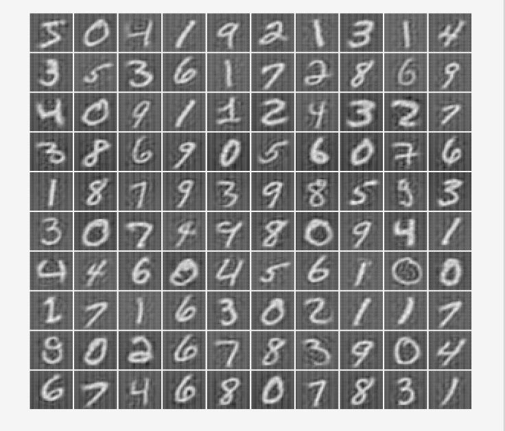
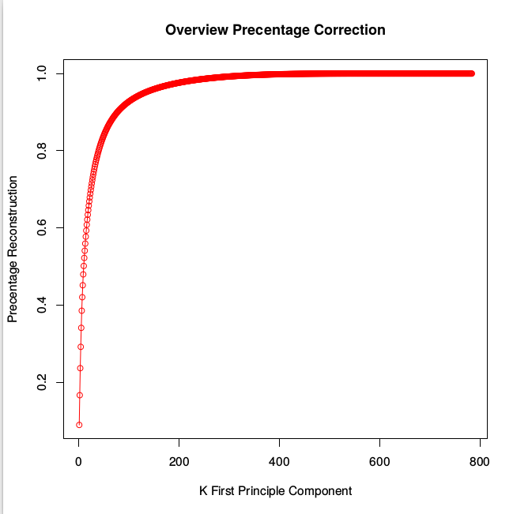
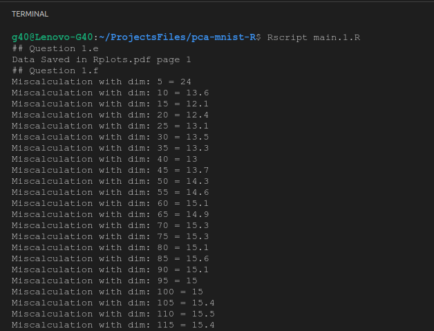
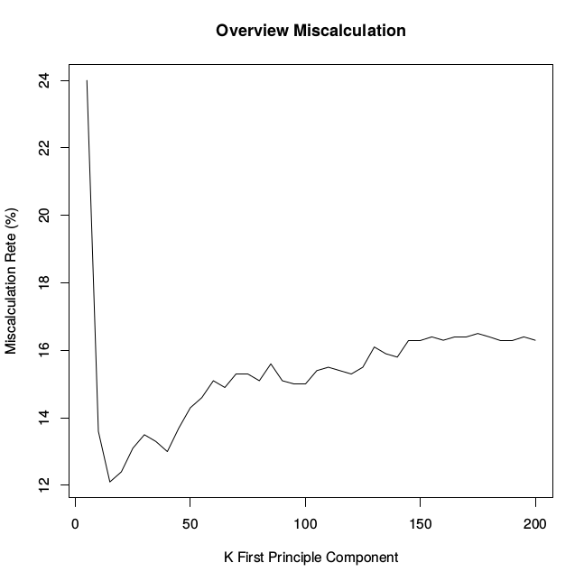

## Dimensionality Reduction using PCA

### Visualize MNIST (784 Dimension)

### 64 First Principle Component

### Reconstruction 64 Dimension Data

### Percentage Correction 64 Dim

### Overview Percentage Correction

### Misclassification Rate

### Graphic Misclassification Rate

